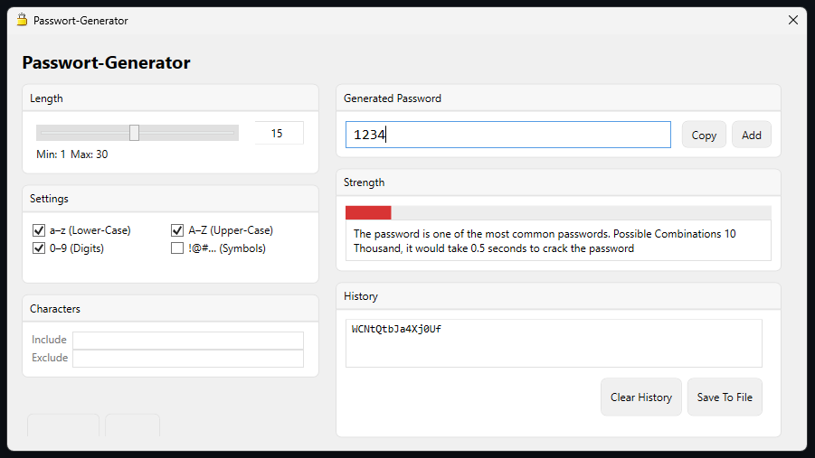

# Advanced C# WPF Password Generator
An Advanced C# Password Generator for Windows.

## Usage
- Generating Safe Passwords
- Auto-detecting common passwords and names
- Password safety rating
- Saving multiple passwords into a text file locally

## Screenshots

## Example Project
An example Project using this PasswordGenerator is [`PasswordGeneratorWPF`](https://github.com/Ben-Scr/PasswordGeneratorWPF)

## Support

